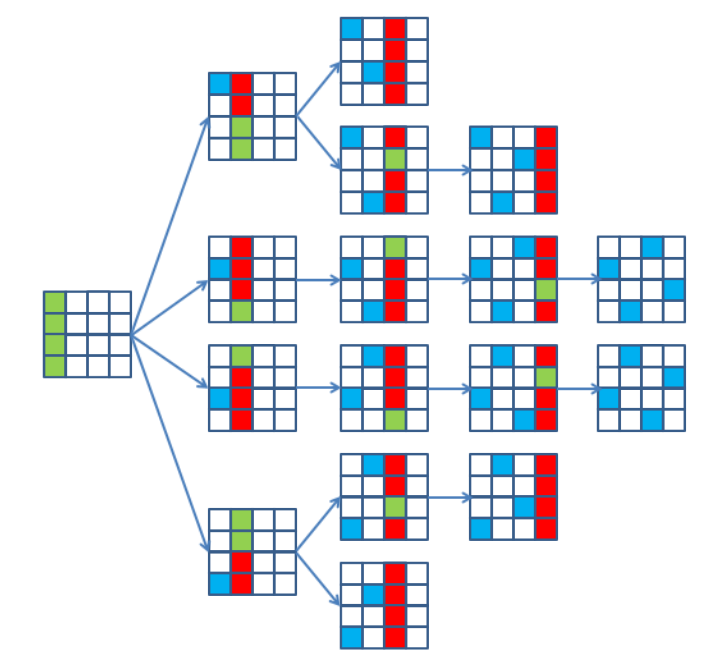

# ADS1 Assignment 3

<b>Note: I somehow missed the capitalized "YOU ONLY NEED TO FIND ONE SOLUTION"
and I made a program which finds ALL the solution, so deal with it.</b>

## The nQueens puzzle

The nQueens puzzle asks how to place n queens on an n-by-n chess board so that no queen can attack another. A trivial solution exists for n = 1, but otherwise it is only solvable for n > 3.

The puzzle can be solved using a backtracking algorithm in the following way:

- Try to place a queen in a cell of the first column.
- Then try placing a queen in the second column.
- Continue the approach to the last column, and backtrack whenever a queen cannot be placed.

This is illustrated as a backtracking tree for the n = 4 problem below (green = possible, blue = placed, red = not possible). In this illustration, all solutions are found. YOU ONLY NEED TO FIND ONE SOLUTION.

Your task is to implement the backtracking algorithm for solving the nQueens puzzle in Java. It will have the same structure as the algorithm for solving a sudoku, so you may use that for inspiration.

The assignment must be handed in no later than April 28 at 23.55. Feedback is due May 5 at 23.55.