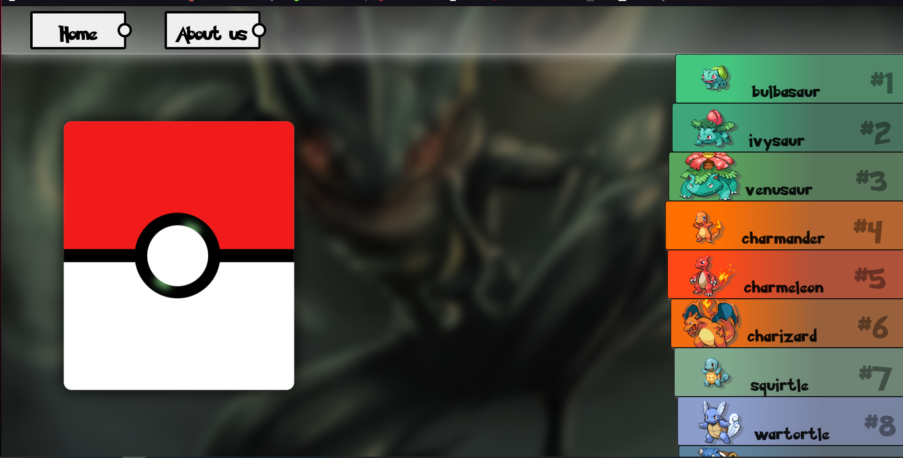

# Semester 4 WEB2 Assignment 2

Note 1: This website is created using pure CSS, no external CSS frameworks were used. Also it works best on the latest chrome
version, I haven't tried them on other websites (some newer CSS selectors are used, like :has() and others, which might
be incompatible with older browser versions)

Note 2: The website is not responsive, it was designed for desktop users.

View the website here: https://enbi81.github.io/SEP4ExercisesAndHandins/

## Thanks to
- <a href="https://pokeapi.co/">PokeAPI</a> | for serving the data and having nice documentation
- <a href="https://perthirtysix.com/tool/pokemon-explorer">Pokemon Explorer</a> | for helping in understanding the pokemon world
- <a href="https://www.favicon.cc/?action=icon&file_id=835064">favicon.cc and azfreeman</a> for the favicon.ico 
- https://wallpaperset.com/best-pokemon-wallpapers for the amazing wallpapers

## Design ideas
- Pokemon list (on the right side): 
  - The movement and the animations came from the popular game <a href="https://osu.ppy.sh/home">Osu!</a>
  - <a href="https://github.com/CrASH285">Crash285</a> was helping with the inner design of a list item (a single pokemon) 
- Pokemon detailed view (on the left side):
  - Some parts of this view was inspired by this <a href="https://dribbble.com/shots/6540871-Pokedex-App">beautiful design</a>

## Other sources used during the development
- https://htmldom.dev/drag-to-scroll/
- https://www.jqueryscript.net/demo/Interactive-Parallax-Tilt-Effect-jQuery-Tilt-js/ (this is more like inspiration, I haven't used any code from this)
- https://stackoverflow.com/questions/47011055/smooth-vertical-scrolling-on-mouse-wheel-in-vanilla-javascript

## GUI Development roadmap

### List view

First design of a single list item:
 

 
 

Then with the help of <a href="https://github.com/CrASH285">Crash285</a> we created the final design: 
 

 
 
 

For a little Easter Egg, check the console, and follow the bunny's
instruction.

### Pokemon Detailed view

Had a hard time getting the inspiration for this part of the website.
I already knew I want the image in the top-right corner.

 
First try with the design
 

 
 

Second try with the design (actually the design of the contents here is very 
similar of the current design, as I just moved the height, weight and generation
information below the name).

 

 
 

Then came the 3D effect
 

 
 

And then the rest was kind of obvious
 

 
 

After playing with the design a bit, a need for a shadow for the image
started to arose
 

Image shadow version 1 (no shadow)
 

  
Image shadow version 2 (a small shadow)
 

  
Image shadow version 3 (larger shadow) (only on hover)
 

### Website's current state after the list and detailed view

Quickly finished the loading screen, this is how it looked like:

### Background and Header

The next task was to add the background image and create the header.

It was hard to come up with a header, the image above was the first 
version of the header which was acceptable. There was a lot of trying with 
linear-gradients, different colors. The navigation bar buttons still were off
a bit though.

 
 

Version 2

Version 3

### Website's current state after background and header

 
 

##### Easter egg

If you read the text till here then congratulations! 
Thank you for being interested in my work! 
To reward your interest, there is a little Easter Egg hidden
in the header. Hover your mouse over the 'Home' navigation button,
and keep the mouse over it for around 15 seconds :D
